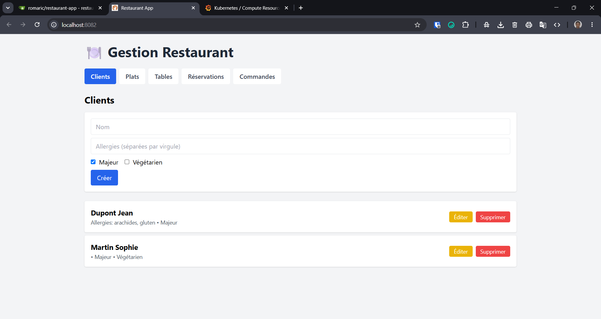
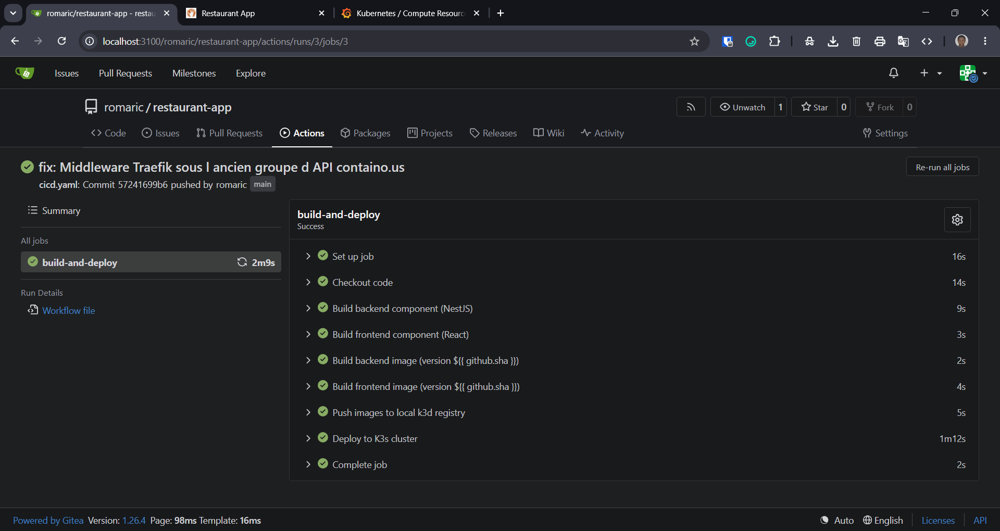
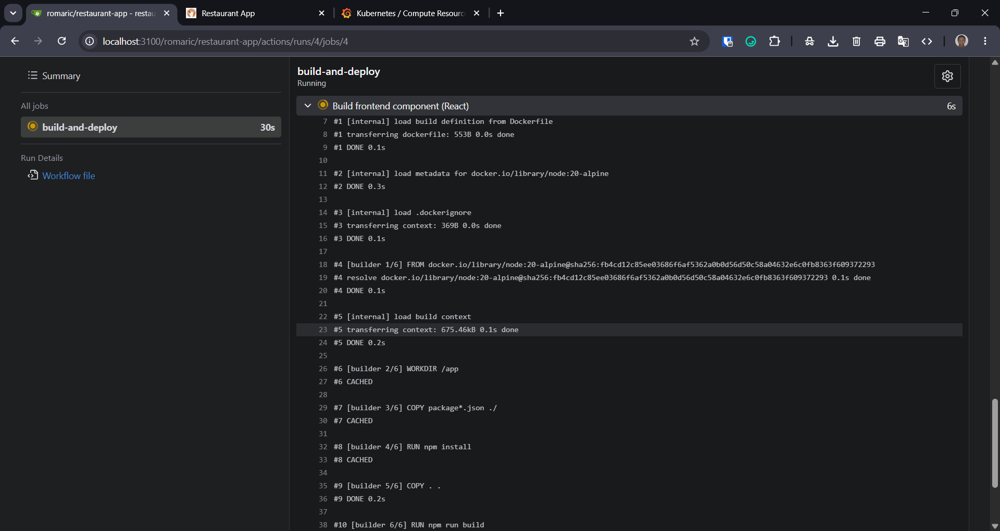
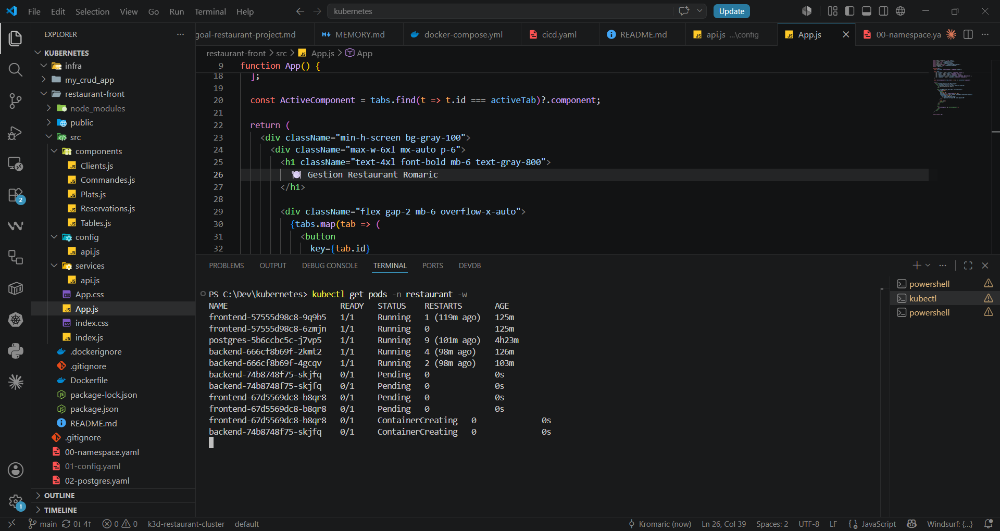
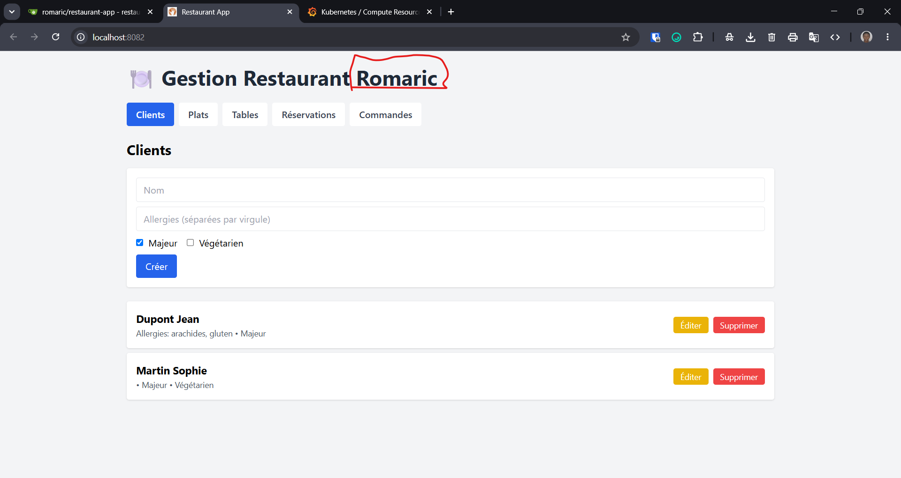
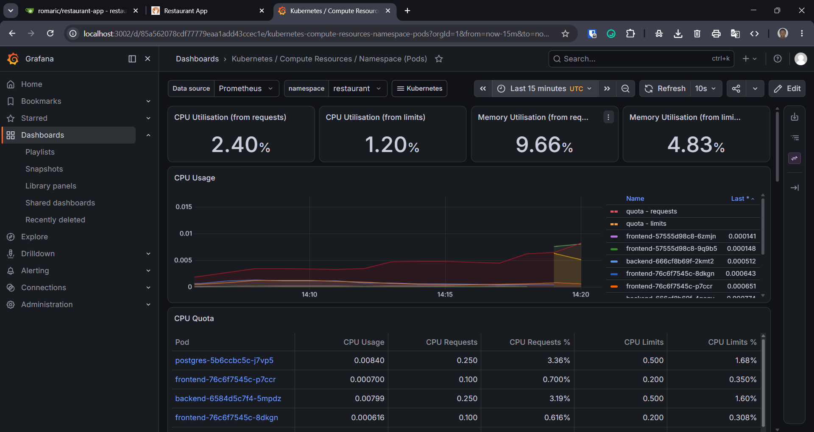
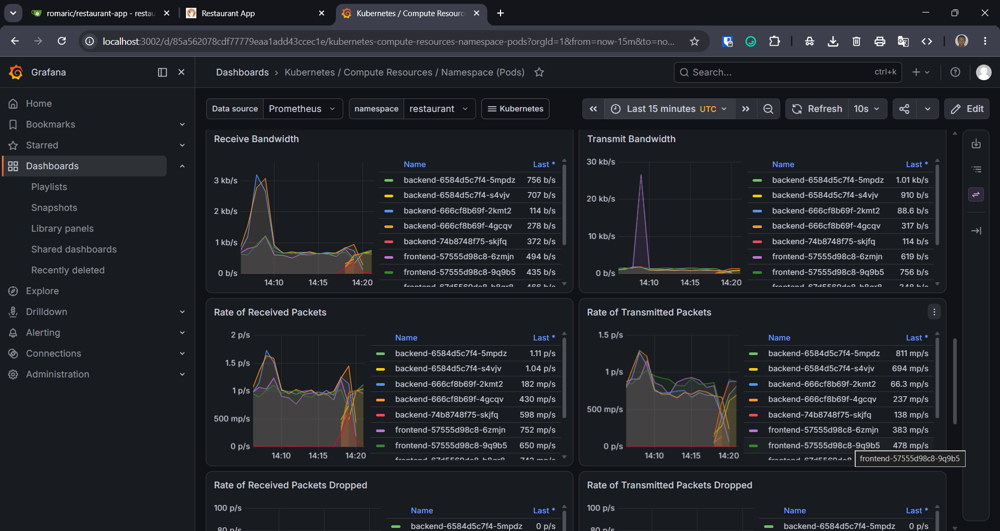
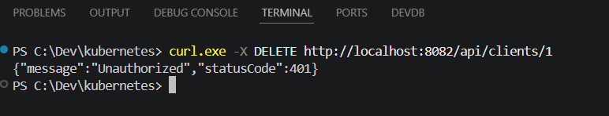
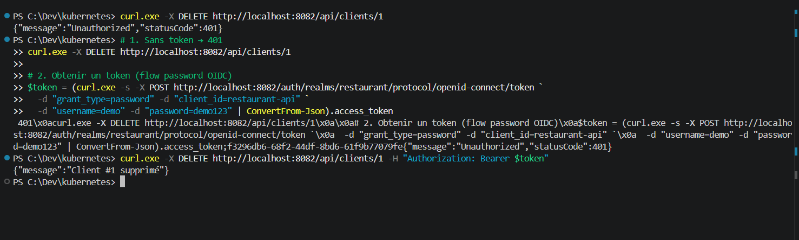
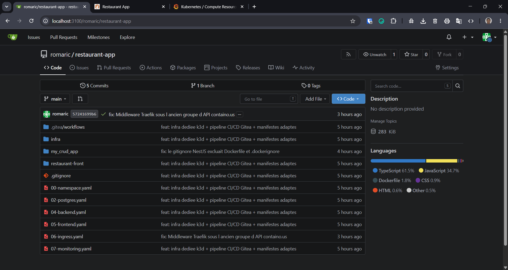

# Restaurant App — CI/CD sur Kubernetes

TP Kubernetes : cluster k3d avec pipeline CI/CD complet (Gitea Actions), monitoring
Prometheus/Grafana, et authentification OAuth2/OIDC (Keycloak).

**Application** : gestion de restaurant — backend **NestJS** (`my_crud_app`),
frontend **React** (`restaurant-front`), base **PostgreSQL**.
>
> 
---

## 1. Architecture

```
┌────────────────────────────────────────────────────────────────────┐
│                           HOST MACHINE                             │
│                                                                    │
│  ┌────────────────┐        ┌─────────────────────────────────────┐ │
│  │ Gitea :3100    │        │   Cluster k3d "restaurant-cluster"  │ │
│  │ (serveur git)  │        │                                     │ │
│  │                │ deploy │  namespace: restaurant              │ │
│  │ ┌────────────┐ │        │  ┌────────┐ ┌─────────┐ ┌────────┐  │ │
│  │ │   Runner   │─┼────────┼─▶│ Front  │ │ Backend │ │Postgres│  │ │
│  │ │ (CI/CD)    │ │        │  │ React  │ │ NestJS  │ │        │  │ │
│  │ └────────────┘ │        │  └───┬────┘ └───┬─────┘ └────────┘  │ │
│  └────────────────┘        │      │          │                   │ │
│                            │  ┌───┴──────────┴───────┐           │ │
│  ┌────────────────┐  push  │  │  Ingress (Traefik)   │◀── :8082  │ │
│  │ Registry :5002 │◀───────┼──│  /      → front      │           │ │
│  │ (images)       │────────┼─▶│  /api   → backend    │           │ │
│  └────────────────┘  pull  │  │  /auth  → keycloak   │           │ │
│                            │  └──────────────────────┘           │ │
│                            │                                     │ │
│                            │  namespace: security                │ │
│                            │  ┌──────────┐                       │ │
│                            │  │ Keycloak │  OAuth2 / OIDC        │ │
│                            │  └──────────┘                       │ │
│                            │                                     │ │
│                            │  namespace: monitoring              │ │
│                            │  │ Prometheus │ Grafana │ AlertMgr  │ │
│                            └─────────────────────────────────────┘ │
└────────────────────────────────────────────────────────────────────┘
```

**Choix techniques :**
- **k3d** : cluster k3s dans Docker, léger et reproductible, avec registre d'images intégré.
- **Gitea + Act Runner** : serveur git auto-hébergé avec CI/CD compatible GitHub Actions.
- **Traefik** : ingress controller fourni nativement par k3s.
- Le runner partage le réseau Docker du cluster (`k3d-restaurant-cluster`), ce qui
  lui permet de pousser au registre et de joindre l'API server pour déployer.

---

## 2. Accès aux services

| Service | URL | Identifiants |
|---------|-----|--------------|
| Frontend | http://localhost:8082 | — |
| API (Swagger sur `/api`) | http://localhost:8082/api | — |
| Gitea | http://localhost:3100 | compte admin |
| Keycloak | http://localhost:8082/auth | `admin` / `admin` |
| Grafana | http://localhost:3002 (port-forward) | `admin` / mot de passe via secret |

---

## 3. Pipeline CI/CD

Chaque `git push` sur `main` déclenche [`.gitea/workflows/cicd.yaml`](.gitea/workflows/cicd.yaml) :

| Étape | Description |
|-------|-------------|
| **1. Build des composants** | Compilation NestJS et React (stage `builder` des Dockerfiles multi-stage). Une erreur de compilation stoppe le pipeline. |
| **2. Build des images versionnées** | Chaque commit produit un tag d'image unique : `restaurant-backend:<sha-du-commit>`. |
| **3. Push au registry** | Images poussées vers le registre k3d local (`localhost:5002`). |
| **4. Rollout** | `kubectl set image` pointe les Deployments vers la nouvelle version, puis `kubectl rollout status` vérifie que le rolling update converge (zéro interruption de service). |

> 📸 **Capture — pipeline vert dans Gitea (onglet Actions) :**
>
> 

> 📸 **Capture — rolling update en direct (`kubectl get pods -n restaurant -w`) :**
>
> 
>
> 
>
>📸 **Capture — du résultat**

> 

**Subtilité registre** : le pipeline pousse sur `localhost:5002` (port publié sur
l'hôte) mais les manifestes tirent depuis `restaurant-registry:5000` (nom interne
au réseau Docker) — deux noms pour le même registre.

**Subtilité kubeconfig** : le job remplace l'adresse locale de l'API server par son
hostname interne (`k3d-restaurant-cluster-server-0:6443`), joignable depuis le
conteneur du job. Le kubeconfig est fourni au pipeline via un secret Gitea
(`KUBECONFIG`), extrait avec `kubectl config view --minify --flatten`.

---

## 4. Monitoring (Prometheus + Grafana)

Stack **kube-prometheus-stack** (Helm) dans le namespace `monitoring` :
Prometheus collecte les métriques CPU/RAM de tous les conteneurs via **cAdvisor**
(intégré au kubelet) — aucune instrumentation du code n'est nécessaire pour cela.

Visualisation dans Grafana, dashboard intégré
**Kubernetes / Compute Resources / Namespace (Pods)** sur le namespace `restaurant` :

> 📸 **Capture — CPU/RAM des pods backend, frontend et postgres :**
>
> 
>
> 

```powershell
# Accès à Grafana
kubectl --namespace monitoring port-forward svc/kube-prometheus-stack-grafana 3002:80
```

Vérification équivalente en CLI : `kubectl top pods -n restaurant`.

---

## 5. Complément : OAuth2 / OIDC avec Keycloak

**Keycloak 26** est déployé dans le namespace **`security`**
([`08-keycloak.yaml`](08-keycloak.yaml)), servi sous http://localhost:8082/auth
via l'Ingress. Le realm `restaurant` (client OIDC `restaurant-api` + utilisateur
de démo) est **importé automatiquement au démarrage** via une ConfigMap.

L'endpoint **`DELETE /api/clients/:id`** est protégé par un Guard NestJS
(`passport-jwt`) qui valide les JWT émis par Keycloak :

- la **signature** est vérifiée via les clés publiques JWKS, récupérées par
  l'URL interne au cluster (`keycloak-svc.security.svc...`) ;
- l'**issuer** attendu est l'URL publique (`http://localhost:8082/auth/realms/restaurant`),
  celle vue par le client qui a obtenu le token.

### Démonstration

```powershell
# 1. Sans token → 401 Unauthorized
curl.exe -i -X DELETE http://localhost:8082/api/clients/1

# 2. Obtention d'un token (flow OIDC "password")
$token = (curl.exe -s -X POST http://localhost:8082/auth/realms/restaurant/protocol/openid-connect/token `
  -d "grant_type=password" -d "client_id=restaurant-api" `
  -d "username=demo" -d "password=demo123" | ConvertFrom-Json).access_token

# 3. Avec le token → 200 OK
curl.exe -i -X DELETE http://localhost:8082/api/clients/1 -H "Authorization: Bearer $token"
```

> 📸 **Capture — 401 sans token puis 200 avec token :**
>
> 

> 

---

## 6. Structure du dépôt

```
├── .gitea/workflows/cicd.yaml   # Pipeline CI/CD
├── 00-namespace.yaml            # Namespace restaurant
├── 01-config.yaml               # ConfigMap + Secret (hors dépôt, appliqué à la main)
├── 02-postgres.yaml             # PostgreSQL + PVC
├── 04-backend.yaml              # Backend NestJS (probes, resources, config Keycloak)
├── 05-frontend.yaml             # Frontend React (nginx)
├── 06-ingress.yaml              # Ingress Traefik + Middleware StripPrefix (/api)
├── 07-monitoring.yaml           # HPA backend & frontend
├── 08-keycloak.yaml             # Keycloak (namespace security) + realm importé
├── infra/                       # Infra locale : Gitea, runner, script cluster
│   └── README.md                # Procédure d'installation détaillée
├── my_crud_app/                 # Backend NestJS (+ src/auth : guard JWT)
└── restaurant-front/            # Frontend React
```
> 


---

## 7. Difficultés rencontrées

- **`ImagePullBackOff`** : confusion entre le nom du registre vu de l'hôte
  (`localhost:5002`) et vu du cluster (`restaurant-registry:5000`).
- **Dockerfile absent du dépôt** : le template `.gitignore` NestJS excluait
  `Dockerfile` — le build CI échouait alors qu'il passait en local.
- **CRD Traefik** : le Traefik 2.9 embarqué par k3s expose l'ancien groupe d'API
  `traefik.containo.us/v1alpha1` (et non `traefik.io/v1alpha1`).
- **node-exporter en `CreateContainerError`** : bug connu sur k3d, corrigé avec
  `prometheus-node-exporter.hostRootFsMount.enabled=false`.
- **Kubeconfig multi-clusters** : extraction du seul contexte utile avec
  `kubectl config view --minify --flatten` avant de créer le secret Gitea.
- **Issuer OIDC** : l'URL de Keycloak vue du navigateur diffère de celle vue du
  backend dans le cluster — d'où la séparation JWKS interne / issuer public.
